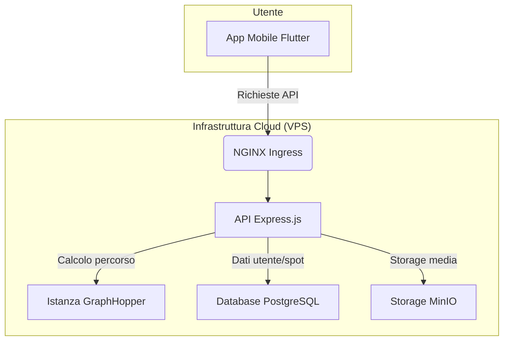

# EasyCamper: Il copilota per camperisti

**EasyCamper** è un sistema completo per la pianificazione di viaggi in camper, progettato per offrire un'esperienza di navigazione sicura e consapevole, una ricca community di spot e servizi in tempo reale.

Questo repository contiene l'intero monorepo del progetto, che include:

1.  **App Mobile (Flutter)**: L'applicazione cross-platform per iOS e Android, cuore dell'esperienza utente.
2.  **API Backend (Node.js/Express)**: Il server che gestisce la logica di business, gli utenti, gli spot e l'interfacciamento con i servizi esterni.
3.  **Istanza GraphHopper**: Il motore di routing self-hosted, ottimizzato con profili di guida "camper-aware" per calcolare percorsi che tengono conto di altezze, pesi e dimensioni dei veicoli.
4.  **Servizi di supporto**: Script, configurazioni Docker e tutto il necessario per l'orchestrazione e il deploy.

---

## Architettura in sintesi



---

## Documentazione

La visione completa del progetto, le scelte architetturali, la checklist di sviluppo e le milestone sono documentate nella nostra roadmap.

➡️ **Leggi la [Roadmap del Progetto](docs/roadmap.md)**

---

## Quickstart (Ambiente di sviluppo locale)

Per avviare i servizi principali in locale, utilizzare il file `docker-compose.yml` presente nella root del progetto:

```bash
# Avvia il backend, il database e GraphHopper
docker-compose up -d

# Avvia l'app Flutter (assicurati di avere un emulatore in esecuzione)
# Nota: utilizziamo la versione di Flutter locale per questo progetto
./tools/flutter/bin/flutter run
```

---
*Questo progetto è stato sviluppato con il supporto di GitHub Copilot.*
