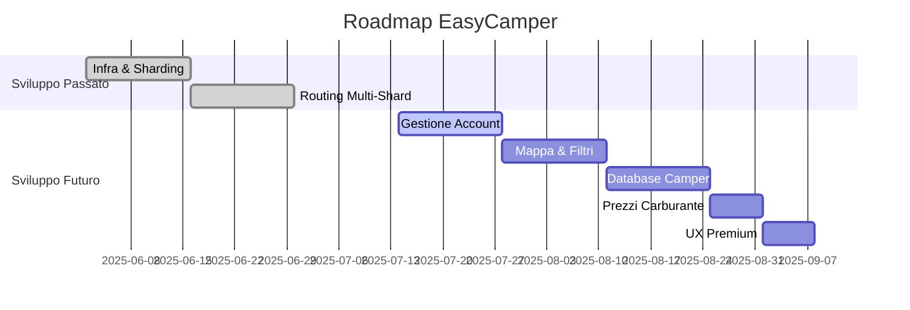

# EasyCamper – Roadmap & Checklist (Aggiornata al 24/07/2025)

## 0. Vision
«Un’unica app per camperisti con routing “camper-aware”, community spot, filtri avanzati, prezzi carburante in tempo reale e navigazione integrata in-car».

---

## 1. Infra & Sharding – COMPLETATO
- [x] **VPS IONOS unico nodo (8 GB RAM)**
  - **Stato:** L'infrastruttura Docker è stata creata, testata e validata.
- [x] **Definizione e creazione Shard**
  - **Stato:** Completato. Il sistema è stato suddiviso in **5 shard** per una distribuzione ottimale del carico.
  - **Shard di Produzione (`/shards`):** `europa-nord`, `europa-centro`, `europa-ovest`, `europa-sud`, `europa-sud-est`.
  - **Shard di Test (`/assets/data`):** `nord`, `centro`, `ovest`, `sud`, `sud-est`.
- [x] **Importazione e Caching GraphHopper**
  - **Stato:** Completato. L'importazione per tutti e 5 gli shard è automatizzata tramite `docker-compose`. Le cartelle `graph-cache` vengono generate e caricate correttamente.

---

## 2. Routing Multi-Shard – COMPLETATO
- [x] **Architettura di Routing Custom**
  - **Stato:** Completato. È stata implementata un'architettura custom robusta per gestire percorsi che attraversano più shard.
  - **Componenti Chiave:**
    - **`Orchestrator`:** Un servizio Node.js dedicato che riceve le richieste, interroga gli shard necessari e "cuce" insieme i segmenti di percorso.
    - **`NGINX`:** Funge da reverse proxy, smistando il traffico verso l'orchestrator.
    - **`server/utils/shardUtils.js`:** Contiene la logica per determinare lo shard corretto in base alle coordinate.
- [x] **Modelli di Routing Camper-Aware**
  - **Stato:** Completato. I modelli `camper_eco`, `camper_scenic`, `camper_fast` sono stati creati e vengono caricati correttamente da ogni shard.
- [x] **Test di Copertura**
  - **Stato:** Completato. Sono stati implementati test di integrazione (`server/__tests__/route.test.js`) che validano sia i percorsi single-shard che quelli multi-shard.

---

## 3. Gestione Account Utente – PRIORITÀ ALTA
- [x] **Registrazione e Login:**
  - [x] Autenticazione tramite email/password (completata, testata, funzionante)
  - [x] Autenticazione tramite Google, Apple e Facebook (completata, testata, funzionante)
- [x] **Gestione Account:**
  - [x] Cambia indirizzo email con verifica tramite link di conferma (vecchio e nuovo indirizzo, token, scadenza, blocco login con email non verificata, test automatici)
  - [x] Log delle modifiche sensibili (cambio email, password, ecc.) nell’audit log
  - [x] Notifica all’utente su cambio email (vecchio e nuovo indirizzo)
  - [x] Rate limiting sulle operazioni sensibili (cambio email/password)
  - [ ] Endpoint/UI per eliminazione account (compliance GDPR)
  - [x] Modifica password (completata, testata, funzionante)
  - [x] Visualizza e modifica i dati personali (completata, testata, funzionante)
  - [ ] Gestione del veicolo (collegato al database camper) (da fare)
- [x] **Sicurezza e multi-device:**
  - [x] Refresh token ruotati, massimo 2 device attivi, revoca manuale device (completata, testata, funzionante)
  - [x] Audit log operazioni utente (completata, testata, funzionante)
  - [x] Notifica login/revoca device (mock via console.log, completata)
  - [x] Salvataggio IP e fingerprint (completata)
  - [x] Test automatici sicurezza (completata)

---

## 4. Monetizzazione – MEDIA
- [ ] **Logica Freemium/Premium:**
  - [ ] Definire i vantaggi per gli utenti premium (es. filtri avanzati, POI esclusivi).
  - [ ] Implementare il sistema di abbonamento.

---

## 5. Mappa Interattiva & Filtri – ALTA
- [ ] **Filtri Parcheggi:**
  - [ ] Area camper gratuita.
  - [ ] Area camper a pagamento.
  - [ ] Area camper privata.
  - [ ] Parcheggio camper senza servizi.
  - [ ] Area di servizi senza sosta.
  - [ ] Area di picnic.
  - [ ] Area di sosta.
  - [ ] Campeggio.
  - [ ] Nella natura.
  - [ ] Parcheggio giorno e notte.
- [ ] **Filtri Servizi nelle Vicinanze:**
  - [ ] Elettricità (accesso possibile).
  - [ ] Acqua potabile.
  - [ ] Acque nere.
  - [ ] Acque di scarico.
  - [ ] Cestini rifiuti.
  - [ ] Bagni pubblici.
  - [ ] Docce.
  - [ ] Accesso a internet Wi-Fi.
  - [ ] Animali ammessi.
  - [ ] Servizio lavanderia.
  - [ ] Stazione GPL.
  - [ ] Lavaggio per camper.
- [ ] **Valutazione POI:**
  - [ ] Filtro per mostrare i POI in base alla valutazione nelle vicinanze.

---

## 6. Database Camper – MEDIA
- [ ] Creare un database con i modelli di camper van e autocaravan dal 2010 ad oggi.
- [ ] Includere dati come altezza, lunghezza, larghezza, peso, capacità serbatoi, e caratteristiche speciali.
- [ ] Collegare il database alla gestione del veicolo dell'utente.
- [ ] Escludere automobili e altri veicoli non rilevanti.
- [ ] Valutare l'uso di API esterne (es. CarQuery API) per popolare il database iniziale.

---

## 7. Prezzi Carburante – MEDIA
- [ ] Sviluppare `fuelService.js` per recuperare dati da API (es. Openfuel) con un cron job.
- [ ] Creare layer sulla mappa per visualizzare i prezzi.
- [ ] Implementare notifiche push per avvisi sui prezzi.
- [ ] Visualizzare i prezzi del carburante lungo il percorso utilizzando l'interfaccia Mapbox.
  - [ ] Se i dati sono troppo pesanti, limitare la visualizzazione al raggio di 10 km.
- [ ] Mostrare le aree di sosta nel raggio di 30 km, se disponibili.
  - [ ] Se i dati sono troppo pesanti, limitare la visualizzazione al raggio di 10 km.
- [ ] Esplorare l'integrazione con POI rilevanti (es. Michelin, Pilot) e verificare eventuali restrizioni di copyright.

---

## 8. UX Premium – MEDIA
- [ ] Live Activities / Widgets (ETA + prezzo carburante).
- [ ] Wizard “Aggiungi spot” (3 step, validazione inline).
- [ ] AI tagging foto (TFLite on-device, offline).

---

## 9. Observability & Strumenti – BASSA
- [ ] **Logging:** Pino → Loki (Grafana Cloud free tier).
- [ ] **Metrics:** Prometheus + Alertmanager.
- [ ] **Tracing:** Grafana Tempo (Docker).
- [ ] **Error Reporting:** Sentry free plan (mobile + backend).
- [ ] **Visualizzatore Percorsi di Test:**
  - [x] Creato `map.html` per visualizzare i percorsi generati dai test.
  - [ ] Migliorare lo script Python per un aggiornamento automatico.

---

## 10. CI/CD & Backup – BASSA
- [ ] GitHub Actions per build e test automatici.
- [ ] Fastlane per deploy beta nightly su TestFlight / Play Internal.
- [ ] `cron.daily` backup script per database e media.

---

## 11. Kubernetes Integration – MEDIA
- [ ] **MinIO Deployment:**
  - [ ] Creare un file `minio-deployment.yaml` per configurare i pod e i servizi di MinIO.
  - [ ] Configurare volumi persistenti per garantire la conservazione dei dati.
  - [ ] Definire le credenziali di accesso (`MINIO_ACCESS_KEY`, `MINIO_SECRET_KEY`) come `Secrets` in Kubernetes.
- [ ] **Ingress Controller:**
  - [ ] Configurare un Ingress per esporre MinIO tramite un endpoint accessibile.
- [ ] **Integrazione Backend:**
  - [ ] Aggiornare il backend per utilizzare l'endpoint di MinIO su Kubernetes.
- [ ] **Scalabilità e Alta Disponibilità:**
  - [ ] Configurare MinIO in modalità distribuita per garantire alta disponibilità.
  - [ ] Abilitare l'auto-scaling dei pod in base al carico.
- [ ] **Monitoraggio:**
  - [ ] Integrare strumenti di monitoraggio (es. Prometheus, Grafana) per tenere traccia delle prestazioni di MinIO e dei pod Kubernetes.

---

## Checklist Sicurezza
- [x] **helmet:** Attivo e configurato.
- [x] **cors:** Attivo e configurato.
- [ ] **express-rate-limit:** Installato, ma da attivare e configurare in `app.js`.
- [ ] **xss-clean / hpp:** Da installare e configurare.
- [ ] **JWT & Refresh Token:**
  - **Stato Attuale:** Implementata logica base con token senza scadenza per facilitare i test.
  - **Prossimi Passi (pre-produzione):** Implementare scadenza di 15 min per il JWT e logica di Refresh Token (scadenza 30 gg).
- [ ] **Gestione Secrets:** Da verificare e centralizzare (es. Docker secrets, /opt/easycamper/.secrets).

---

## Milestones (Gantt semplificato aggiornato)

> **Target beta pubblica**: fine settimana 9.
