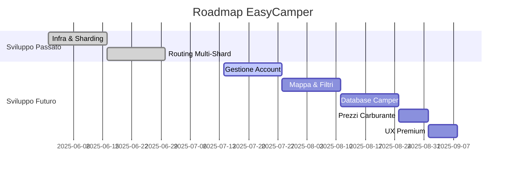

# EasyCamper – Roadmap & Checklist (Aggiornata al 02/12/2025)

> Questa roadmap include sia lo storico delle attività completate che le priorità attuali. Ogni sezione è dettagliata con stato, note operative e checklist tecnica per facilitare la consultazione e la gestione.

## 0. Vision
«Un’unica app per camperisti con routing “camper-aware”, community spot, filtri avanzati, prezzi carburante in tempo reale e navigazione integrata in-car, con copertura POI stile park4night ma più curata, verificata e orientata all’esperienza.»

---

## 1. Infra & Sharding – COMPLETATO
- [x] **VPS IONOS unico nodo (8 GB RAM)**
  - **Stato:** L'infrastruttura Docker è stata creata, testata e validata.
  - **AGGIORNAMENTO agosto 2025:** Tutti gli shard di produzione sono stati trasferiti, verificati e avviati correttamente sulla nuova VPS (158.220.115.27). I container Docker risultano attivi e "Healthy". La parte server/infra è ora realmente completata sulla nuova infrastruttura.
- [x] **Definizione e creazione Shard**
  - **Stato:** Completato. Il sistema è stato suddiviso in **5 shard** per una distribuzione ottimale del carico.
  - **Shard di Produzione (`/shards`):** `europa-nord`, `europa-centro`, `europa-ovest`, `europa-sud`, `europa-sud-est`.
  - **Shard di Test (`/assets/data`):** `nord`, `centro`, `ovest`, `sud`, `sud-est`.
- [x] **Importazione e Caching GraphHopper**
  - **Stato:** Completato. L'importazione per tutti e 5 gli shard è automatizzata tramite `docker-compose`. Le cartelle `graph-cache` vengono generate e caricate correttamente.

---

## 2. Routing Multi-Shard – COMPLETATO
- [x] **Architettura di Routing Custom**
  - **Stato:** Completato. È stata implementata un'architettura custom robusta per gestire percorsi che attraversano più shard.
  - **Componenti Chiave:**
    - **Orchestrator:** Servizio Node.js che riceve le richieste, interroga gli shard necessari e "cuce" i segmenti di percorso.
    - **NGINX:** Reverse proxy che smista il traffico verso l'orchestrator.
    - **server/utils/shardUtils.js:** Logica per determinare lo shard corretto in base alle coordinate.
- [x] **Modelli di Routing Camper-Aware**
  - **Stato:** Completato. Modelli `camper_eco`, `camper_scenic`, `camper_fast` creati e caricati da ogni shard.
- [x] **Test di Copertura**
  - **Stato:** Completato. Test di integrazione (`server/__tests__/route.test.js`) validano percorsi single-shard e multi-shard.

---

## 3. Gestione Account Utente – PRIORITÀ ALTA (BACKEND COMPLETATO, AFFINAMENTI POSSIBILI)
- [x] **Registrazione e Login**
  - Autenticazione email/password, Google, Apple, Facebook (completata, testata, funzionante)
- [x] **Gestione Account**
  - Cambio email con verifica tramite link (vecchio e nuovo indirizzo, token, scadenza, blocco login con email non verificata, test automatici)
  - Log modifiche sensibili (audit log, da estendere GDPR)
  - Notifica cambio email (vecchio e nuovo indirizzo)
  - Rate limiting operazioni sensibili
  - Endpoint/test cancellazione account (GDPR)
  - Modifica password
  - Visualizza/modifica dati personali
  - Gestione veicolo (CRUD, validazione, test automatici)
  - Esportazione dati personali (GDPR)
  - **AGGIORNAMENTO 01/12/2025 – users.js hardening**
    - [x] Sanitizzazione output utente nelle route `/users` (rimozione passwordHash, token e campi interni)
    - [x] Validazioni base input per `POST /users` e `PUT /users/:id` (campi minimi obbligatori, blocco modifiche dirette a campi sensibili)
    - [x] Rafforzato flusso di cambio email:
      - [x] `POST /users/:id/change-email` con validazione formato email, controllo email invariata, logging AuditLog `request_email_change`
      - [x] `GET /users/confirm-email-change` con gestione token mancante/inesistente/scaduto, reset sicuro campi cambio email, logging AuditLog `change_email`
    - [x] Aggiunti test Jest/Supertest per il flusso di cambio email (`__tests__/users.email-change.test.js`)
  - **AGGIORNAMENTO 01/12/2025 – integrazione app Flutter**
    - [x] Schermata `PersonalDataScreen` (Flutter) collegata al backend per cambio email (`POST /users/{id}/change-email`)
    - [x] Uso di `AuthState` (userId, accessToken) per firmare la richiesta di cambio email con JWT
    - [x] Sistemata UI dark mode (testi e label leggibili: "Dati personali", "Lingua preferita", "Cambia email")
  - **AGGIORNAMENTO 02/12/2025 – arricchimento payload login + profilo Flutter**
    - [x] Endpoint `/auth/login` restituisce ora anche `email` e `username` oltre a `userId` e `token`, per permettere al frontend (Flutter) di popolare correttamente il profilo utente (`AuthResult.email`/`AuthResult.username` → `AuthState.session.email`/`AuthState.session.username`).
    - [x] Schermata `ProfileScreen` Flutter legge e mostra `session.email` e `session.username` al posto dell’UUID, con layout dark coerente con login/mappa.

---

## 4. Monetizzazione – MEDIA
- [ ] **Logica Freemium/Premium**
  - Definire vantaggi premium (filtri avanzati, POI esclusivi)
  - Implementare sistema di abbonamento

---

## 5. Mappa Interattiva & Filtri – ALTA (BACKEND + FLUTTER)

### 5.1 Backend Mappa & POI (NUOVO DETTAGLIO)
- [x] **Modello Spot/POI**
  - [x] Definire modello `Spot` con campi base: id, nome, descrizione breve, lat, lng, tipo (enum), rating medio, numero recensioni
  - [x] Definire rappresentazione servizi: modello `SpotService` o campo JSON `services` con booleani (elettricità, acqua, wc, docce, wifi, animali, ecc.)
  - [x] Migrazioni DB e seed iniziale (anche mock) per test mappa
  - [x] Pianificare strategia di copertura POI **ampia** (quanto park4night o superiore) ma con:
    - [x] Miglior qualità dati (deduplica, normalizzazione)
    - [x] Verifiche community e moderazione
    - [x] Tag aggiuntivi per "esperienza" (tranquillo, panoramico, vicino autostrada, super-servizi, ecc.)
- [x] **API REST Spots**
  - [x] `GET /spots` con parametri:
    - `bbox=latMin,lngMin,latMax,lngMax` (viewport Mapbox)
    - `types[]` (filtri parcheggi)
    - `services[]` (filtri servizi)
    - `minRating`
    - paginazione base (page/limit)
  - [x] `GET /spots/:id` per dettaglio completo (descrizione lunga, foto, servizi dettagliati, orari, ecc.)
  - [x] Validazione input e sanitizzazione
  - [x] Test di integrazione per `/spots` e `/spots/:id`
- [x] **Contratto API per frontend/Flutter**
  - [x] Documentare in `server/docs/progetto_frontend.md` lo schema request/response di:
    - `GET /spots`
    - `GET /spots/:id`
  - [x] Allineare nomenclatura campi con `mock_data/spot.json` e con UI Flutter (`spot_marker.dart`, `filters_panel.dart`)

### 5.2 Filtri Parcheggi & Servizi (GIÀ PRESENTI, DETTAGLIO OPERATIVO)
- [x] **Filtri Parcheggi**
  - Area camper gratuita, a pagamento, privata, senza servizi, servizi senza sosta, picnic, sosta, campeggio, natura, giorno/notte
  - [x] Mappare i tipi di parcheggio a valori enum nel modello `Spot`
  - [x] Esporre i tipi come lista statica in documentazione/API (utile per UI)
- [x] **Filtri Servizi nelle Vicinanze**
  - Elettricità, acqua potabile, acque nere, acque di scarico, cestini rifiuti, bagni pubblici, docce, Wi-Fi, animali ammessi, lavanderia, GPL, lavaggio camper
  - [x] Mappare i servizi su chiavi booleane in `services`
  - [x] Gestione query `services[]` su backend (OR/AND, da definire)
- [x] **Valutazione POI**
  - [x] Aggiungere rating medio e numero recensioni al modello `Spot`
  - [x] Filtro `minRating` su `/spots`

### 5.3 Flutter – Mappa Mapbox & Filtri (NUOVO DETTAGLIO)
- [x] **Base Mapbox Flutter**
  - [x] `lib/map_screen.dart` creato
  - [x] `mapbox_gl` installato e verificato
  - [x] Marker e spot di test visualizzati correttamente
  - [x] Gestito il tap sui marker per mostrare dettagli spot
  - [x] Integrazione base mappa Flutter:
    - [x] Schermata mappa principale con Mapbox reale su iOS
    - [x] Permessi `Info.plist` sistemati, build in Release verificata

- [x] **Caricamento POI & fallback mock**
  - [x] Caricamento POI da backend tramite `GET /spots` (alias `/api/spots` lato frontend)
  - [x] Fallback a `mock_data/spot.json` quando il backend non è raggiungibile
  - [x] Mock su macOS: placeholder al posto della mappa + caricamento POI da `mock_data/spot.json`
  - [x] Lista POI su desktop (macOS) sotto la mappa con tap → bottom sheet dettaglio
  - [x] Funzione dettaglio POI riusabile (da lista e da marker)

- [ ] **Integrazione avanzata con backend `/spots` (da completare)**
  - [ ] Definire widget `EasyCamperMap` che incapsula `MapboxMap` e callback di movimento camera
  - [ ] Quando la camera si ferma, chiamare `GET /spots?bbox=...&filters...`
  - [ ] Tradurre la risposta `/spots` in marker Mapbox (SymbolOptions / layer dedicato)
  - [ ] Gestire caricamento (loader) e errori rete

- [x] **Filtri mappa (UI) – PRIMA PASSATA**
  - [x] Gestione filtri mappa (tipologia parcheggi, servizi, rating minimo, raggio, tipologia) con pannello apri/chiudi
  - [x] Pannello filtri collegato alla UI (`filters_panel.dart`)

- [ ] **Pannello filtri collegato alle API (DA FARE)**
  - [ ] Collegare `filters_panel.dart` a uno state management (Provider/Riverpod/Bloc, da definire)
  - [ ] Mappare selezioni filtri → query param di `/spots`
  - [ ] Aggiornare automaticamente i marker quando cambiano i filtri

- [ ] **Popup dettagli spot (DA FARE)**
  - [ ] Implementare bottom sheet (es. `DraggableScrollableSheet`) che mostra dettagli spot usando `/spots/:id`
  - [ ] Collegare tap markers → apertura popup con dati reali (ora mockata)

- [ ] **Ottimizzazioni UX mappa**
  - [ ] Gestione posizione utente (“my location”)
  - [ ] Animazioni di transizione/zoom coerenti
  - [ ] Test UX su device reali (scorrimento mappa, fluidità marker, apertura popup)

---

## 6. Database Camper – MEDIA (BACKEND + INTEGRAZIONE VEICOLO)

- [x] **Modello CamperModel**
  - [x] Creare modello `CamperModel` con: marca, modello, anno, altezza, lunghezza, larghezza, peso, serbatoi, caratteristiche speciali
  - [x] Aggiungere migrazione e seed iniziale (anche da CSV/API esterna)
- [x] **Integrazione con veicolo utente (prima fase: VehicleModel)**
  - [x] Creare modello `VehicleModel` con: brand, model, year_from, length_m, height_m, weight_kg, type, brand_slug (mappato a tabella `VehicleModels`)
  - [x] Aggiungere seed iniziale da `server/easycamper/server/data/vehicle_models.json` tramite `sync.js` (upsert idempotente)
  - [x] Esporre API REST `GET /api/vehicle-models?search=&brand=&limit=&offset=` con filtro su brand+model (search), brand e paginazione
  - [x] Aggiungere test Jest/Supertest per `/api/vehicle-models` (struttura paginata, filtri search/brand, paginazione)
  - [x] Aggiungere campo opzionale `vehicleModelId` a `Vehicle` e relativa associazione `belongsTo(VehicleModel)`
  - [x] Estendere `/vehicles` (POST/PUT) per accettare `vehicleModelId` e, se i campi tecnici (length/height/weight) non sono specificati, ereditarli dal `VehicleModel` associato
  - [x] Aggiungere test Jest/Supertest per integrazione `/vehicles` ↔ `VehicleModels` (`__tests__/vehicles.vehicleModel.test.js`)
  - [x] Campo `vehicleModelId` in `Vehicle` definito come UUID coerente con `VehicleModel.id` e usato come FK logica ORM (belongsTo) senza imporre vincolo FK DB tramite sync automatico, preparatorio per routing camper-aware basato su altezza/lunghezza/peso
  - [ ] Permettere override manuale di parametri tecnici se l’utente personalizza (UI/UX + validazioni avanzate)
  - [ ] Validazione per escludere veicoli non rilevanti
- [ ] **API REST Camper Models (fase successiva)**
  - [ ] `GET /camper-models?brand=&yearFrom=` per selezione modello da app
  - [ ] `GET /camper-models/:id`
  - [ ] Estendere `GET /vehicles/me` (o equivalente) per includere info tecniche sufficienti al routing camper-aware
- [ ] **Popolamento iniziale**
  - [ ] Valutare uso CarQuery API o altre fonti per popolamento iniziale
  - [ ] Script di import (scripts/server) per aggiornamento periodico

> **Nota shard routing (aggiornamento 01/12/2025)**: gli shard GraphHopper di produzione (`/shards`: europa-nord, europa-centro, europa-ovest, europa-sud, europa-sud-est) sono ora ospitati sulla VPS; in repository restano solo i dataset di test più piccoli in `/assets/data` (nord, centro, ovest, sud, sud-est) usati dai test automatici di routing.

---

## 7. Prezzi Carburante – MEDIA (BACKEND + LAYER MAPPA)

- [ ] **Servizio backend carburante**
  - [ ] Implementare `fuelService.js` per recupero dati da API (Openfuel o simili)
  - [ ] Configurare cron job (scripts/ + Docker) per aggiornare prezzi
  - [ ] Definire schema dati per stazioni carburante (id, nome, brand, coordinate, tipo carburante, prezzo, data aggiornamento)
- [ ] **API REST carburante**
  - [ ] `GET /fuel/stations?lat=&lng=&radius=` per mostrare distributori in un raggio dalla posizione/mappa
  - [ ] (Opzionale) `GET /fuel/stations/along-route` per prezzi lungo il percorso GraphHopper
- [ ] **Integrazione con mappa**
  - [ ] Layer mappa prezzi carburante (icone stazioni su Mapbox Flutter)
  - [ ] Possibilità di limitare visualizzazione a raggio 10 km se dati troppo pesanti
- [ ] **Funzioni aggiuntive (da valutare più avanti)**
  - [ ] Notifiche push avvisi prezzi
  - [ ] Mostrare aree di sosta nel raggio di 30 km (o 10 km se necessario)
  - [ ] Integrazione POI rilevanti (Michelin, Pilot), verificare copyright

---

## 8. UX Premium & Onboarding – MEDIA

### 8.1 UX Premium
- [ ] Live Activities / Widgets (ETA + prezzo carburante)
- [ ] Wizard “Aggiungi spot” (3 step, validazione inline)
- [ ] AI tagging foto (TFLite on-device, offline)

### 8.2 Onboarding & UI Auth Flutter (allineamento Figma/Stitch)
- [ ] **Allineare UI auth Flutter al design Figma/Stitch**
  - [ ] Schermata `EC_login` (`LoginScreen`): layout, sfondi, immagine hero, bottoni social
  - [ ] Schermata `EC_registrazione_nuovo_utente` (`RegisterScreen`): ordine campi, bottoni social, stile card
  - [ ] Flusso reset password (`EC_password_reset`, `EC_mail_sent_password`): testi e layout

- [ ] **Integrazione funzionale onboarding**
  - [ ] Verificare flusso end-to-end: registrazione → login → set veicolo minimo → arrivo in mappa
  - [ ] Agganciare correttamente errori backend (email già in uso, password debole, ecc.) alla UI
  - [ ] Gestire stati di caricamento ed errori su tutte le schermate di onboarding

---

## 9. Integrazioni Esterne & Pubblicazione – BASSA/MEDIA

- [ ] Integrazione con API esterne per meteo e traffico
- [ ] Implementazione sistema di notifiche push
- [ ] Ottimizzazione performance e riduzione consumo batteria
- [ ] Test e debug su dispositivi Android
- [ ] Pubblicazione su App Store e Google Play

---

## 10. Observability & Strumenti – BASSA
- [ ] Logging: Pino → Loki (Grafana Cloud free tier)
- [ ] Metrics: Prometheus + Alertmanager
- [ ] Tracing: Grafana Tempo (Docker)
- [ ] Error Reporting: Sentry free plan (mobile + backend)
- [x] Visualizzatore Percorsi di Test: Creato `map.html` per visualizzare i percorsi generati dai test
- [ ] Migliorare script Python per aggiornamento automatico

---

## 11. CI/CD & Backup – BASSA
- [ ] GitHub Actions per build/test automatici
- [ ] Fastlane per deploy beta nightly su TestFlight / Play Internal
- [ ] cron.daily backup script per database e media

---

## 12. Kubernetes Integration – MEDIA
- [ ] MinIO Deployment: file `minio-deployment.yaml`, volumi persistenti, credenziali come Secrets
- [ ] Ingress Controller: configurare Ingress per endpoint MinIO
- [ ] Integrazione Backend: aggiornare backend per endpoint MinIO su Kubernetes
- [ ] Scalabilità/Alta Disponibilità: MinIO distribuito, auto-scaling pod
- [ ] Monitoraggio: Prometheus, Grafana per prestazioni MinIO e pod Kubernetes

---

## Miglioramenti gestione veicoli e specifiche tecniche
- [x] Validazione avanzata su tutti i campi obbligatori/opzionali
- [x] Ownership/permessi: messaggi di errore chiari, logging tentativi non autorizzati
- [x] Test automatici edge case: dati mancanti, formati errati, accessi da utenti diversi, errori DB, autenticazione
- [x] Documentazione API dettagliata
- [x] Gestione dati correlati: cascade delete specifiche/interventi manutenzione
- [x] Logging strutturato per tutte le operazioni CRUD/errori
- [x] Paginazione/filtri su GET /vehicles
- [x] Risposte API coerenti/dettagliate
- [x] Refactoring middleware validazione/ownership
- [x] Sicurezza: protezione da accessi non autorizzati, injection, attacchi comuni

### Flutter – Gestione veicoli (aggiornamenti locali)
- [x] Campi tecnici veicolo obbligatori e validati in UI (lunghezza/altezza/larghezza/peso) per navigazione camper-aware
- [x] Rimossa (per ora) la ricerca catalogo modelli dal form veicolo: inserimento manuale come flusso principale
- [x] Immagine veicolo opzionale in "I miei veicoli" con salvataggio locale (SharedPreferences) e preview in lista
- [x] Pulizia automatica immagine veicolo in SharedPreferences quando un veicolo viene eliminato
- [x] Fix UI: bottone "AVVIA NAVIGAZIONE" con testo bianco
- [x] Blocco avvio navigazione se non esiste almeno 1 veicolo salvato (redirect a schermata inserimento veicolo)

---

## Checklist Sicurezza
- [x] helmet: attivo/configurato
- [x] cors: attivo/configurato
- [x] express-rate-limit: installato e configurato (100 req/15min)
- [x] xss-clean / hpp: sanitizzazione custom e HPP applicati
- [x] JWT & Refresh Token: scadenza e gestione sicura implementate
- [x] Gestione Secrets: documentata in `secrets.md` e centralizzata via `.env` e Docker secrets

---

## Gestione Secrets – CRITICO
- Tutti i secrets (JWT_SECRET, REFRESH_TOKEN_SECRET, credenziali DB, MinIO, ecc.) devono essere gestiti tramite variabili d’ambiente sicure o Docker secrets.
- Nessun secret deve essere hardcoded nel codice o nei file di configurazione versionati.
- Si consiglia di centralizzare la documentazione dei secrets richiesti in `server/docs/secrets.md` (senza includere valori reali).
- Verificare che i file `.env` non siano mai committati su GitHub.
- Esempio di variabili da gestire:
  - JWT_SECRET
  - REFRESH_TOKEN_SECRET
  - POSTGRES_USER / POSTGRES_PASSWORD / POSTGRES_DB
  - MINIO_ACCESS_KEY / MINIO_SECRET_KEY / MINIO_ENDPOINT
  - EMAIL_SERVICE_API_KEY
- In produzione, usare solo Docker secrets o variabili d’ambiente fornite dal sistema.

---

## Milestones (Gantt semplificato aggiornato)

```mermaid
gantt
    title Roadmap EasyCamper
    dateFormat  YYYY-MM-DD
    axisFormat  %Y-%m-%d

    section Sviluppo Passato
    Infra & Sharding      :done, 2025-06-02, 14d
    Routing Multi-Shard   :done, 2025-06-16, 14d

    section Sviluppo Futuro
    Gestione Account      :active, 2025-07-14, 14d
    Mappa & Filtri        :2025-07-28, 14d
    Database Camper       :2025-08-11, 14d
    Prezzi Carburante     :2025-08-25, 7d
    UX Premium            :2025-09-01, 7d
```

> **Target beta pubblica**: fine settimana 9.

---

## FRONTEND/UI (aggiunto il 26/07/2025)

Consulta e aggiorna il documento:
[server/docs/progetto_frontend.md](progetto_frontend.md)

### Sintesi struttura frontend
- Tecnologia: React + TypeScript + Vite
- UI: Shadcn/UI + Tailwind CSS
- Mappe: GraphHopper + Mapbox
- Storage: GitHub Spark KV + React State
- Target: Web App responsive (mobile-first)
- Componenti principali: autenticazione, gestione veicoli, mappa, filtri, spot, recensioni, dashboard
- Integrazione API backend: endpoints e modelli dati dettagliati

### Task operativi suggeriti
- [ ] Validare la struttura frontend rispetto alle API backend
- [ ] Prototipare schermate principali (login, dashboard, mappa, veicoli)
- [ ] Collegare i servizi API e testare flussi utente
- [ ] Ottimizzare UX e mobile-first design
- [ ] Integrare funzioni innovative (AI, filtri smart, live widgets)
- [ ] Testing e validazione end-to-end

---

## FUNZIONALITÀ INNOVATIVE (aggiornato)

### Gamification & Community
- [ ] Sistema di badge e ranking per utenti attivi (aggiunta spot, recensioni, foto, suggerimenti)
- [ ] Eventi e raduni virtuali/locali per la community
- [ ] Classifica "camperisti top" e leaderboard mensile
- [ ] Missioni e obiettivi settimanali (es. scoprire nuovi spot, recensire aree di sosta)

### Machine Learning & AI
- [ ] Tagging automatico delle foto degli spot (on-device/offline con TFLite)
- [ ] Raccomandazioni personalizzate di spot e percorsi in base alle preferenze e storico utente
- [ ] Clusterizzazione intelligente dei POI per suggerire aree di interesse
- [ ] Analisi automatica delle recensioni per estrarre sentiment e suggerimenti
- [ ] Chatbot/assistente virtuale per suggerimenti di viaggio e supporto

### Dati real-time e arricchimento
- [ ] Integrazione dati spot da fonti esterne (OpenStreetMap, community, API pubbliche, dove consentito)
- [ ] Layer mappa con servizi in tempo reale (carburante, meteo, traffico, disponibilità spot)
- [ ] Notifiche push personalizzate su eventi, chiusure, novità

---

## INTEGRAZIONE PUNTI SPARK (mock)

### UI/UX & Design System
- [x] Tema EasyCamper Brand: palette colori professionale (verdi/blu)
- [x] Typography System: Inter + Poppins
- [x] Component System: Shadcn v4docker-compose up -d server
- [x] Responsive Design: mobile-first
- [x] Glassmorphism Effects, Animation System

### Mappa Interattiva & POI
- [x] Fallback Map con grid pattern e markers
- [x] Spot Markers colorati per tipo POI
- [x] Spot Selection e Details popup ottimizzato mobile
- [x] Favorite System: heart button, salvataggio spot
- [x] Navigation Button: avvio GraphHopper
- [x] Map Indicators: GraphHopper + Mapbox

### Community & Gamification
- [ ] Eventi e raduni virtuali/locali
- [ ] Classifica "camperisti top" e leaderboard
- [ ] Missioni settimanali (es. scoprire nuovi spot)
- [ ] Travel Challenges, Achievement Badges, Rewards Program

### Differenziatori competitivi
- Navigazione integrata GraphHopper
- Verifiche community e validazione robusta
- Premium Experience: UX superiore, design moderno
- Real-time Data, Smart Filtering (AI-powered)
- Social Features, Gamification, Route Planning avanzato
- Offline Capabilities, Community-driven content

---

## 12. Integrazione Apple CarPlay & Android Auto – ALTA (DETTAGLIO)
- [ ] **Analisi requisiti tecnici e linee guida Apple/Google**
  - [ ] Studiare linee guida Human Interface Apple CarPlay e Android Auto
  - [ ] Verificare limitazioni su interazioni (touch, testo, contenuti ammessi)
- [ ] **Progettazione UI/UX dedicata in-car**
  - [ ] Definire set ridotto di funzioni: mappa, spot essenziali, avvio navigazione, preferiti
  - [ ] Progettare layout con elementi grandi e chiari, senza distrazioni
- [ ] **Sviluppo modulo Flutter per CarPlay/Android Auto**
  - [ ] Valutare plugin/librerie (es. `flutter_carplay` e analoghi per Android Auto) o moduli nativi Swift/Kotlin con bridge
  - [ ] Implementare schermate dedicate per uso in-car
- [ ] **Integrazione Mapbox e GraphHopper per navigazione in-car**
  - [ ] Riutilizzare orchestrator GraphHopper esistente per generare percorsi camper-aware
  - [ ] Definire endpoint dedicato `POST /car/route` (parametri semplificati) per avvio percorso da contesto in-car
  - [ ] Se possibile/consentito da linee guida, permettere anche la **scelta della rotta direttamente in CarPlay/Android Auto** con opzioni semplificate (es. veloce / eco / panoramica), evitando complessità UI
  - [ ] Decidere quando usare navigazione nativa (Apple Maps/Google Maps) vs. rendering percorso custom
- [ ] **Endpoint ottimizzati per in-car (backend)**
  - [ ] `GET /car/spots?bbox=...` → versione "light" di `/spots` con meno campi e limiti più stretti
  - [ ] `POST /car/route` → avvio/aggiornamento percorso dalla testa dell’auto, riusando profilo camper dell’utente
  - [ ] Rate limiting dedicato per richieste in-car
- [ ] **Test e validazione**
  - [ ] Test su simulatori CarPlay/Android Auto
  - [ ] Test su dispositivi reali (dove possibile)
  - [ ] Validazione UX e sicurezza (flussi vocali, notifiche minime)

---

## AGGIORNAMENTO 26/07/2025 – Sviluppo Flutter Mappa & Componenti
- Creati i file base per la schermata mappa Flutter:
  - lib/map_screen.dart (schermata mappa principale, struttura StatefulWidget)
  - lib/spot_marker.dart (widget marker spot/POI, titolo e stato preferito)
  - lib/filters_panel.dart (widget pannello filtri, lista filtri con checkbox)
- Creati i file di test per i componenti:
  - test/map_screen_test.dart (test widget schermata mappa)
  - test/spot_marker_test.dart (test widget marker spot)
  - test/filters_panel_test.dart (test widget pannello filtri)
- Verificata la nomenclatura chiara tra codice e test (tutti i test in /test, suffisso _test.dart)
- Aggiornato main.dart per mostrare la mappa Mapbox all’avvio
- Installata e verificata la dipendenza mapbox_gl
- Marker e spot visualizzati correttamente sulla mappa
- Gestito il tap sui marker per mostrare dettagli spot
- Struttura del progetto Flutter rispettata secondo roadmap

---

## 6. UI/UX Flutter – Miglioramenti Grafici (ALTA PRIORITÀ)

Ecco alcune scelte critiche e creative per migliorare la grafica/UI del progetto EasyCamper in Flutter, basate sulla roadmap e sulle best practice moderne:

- **Tema & Palette Colori**
  - Pro: Rende l’app riconoscibile e coerente col brand. Puoi usare una palette professionale (verdi/blu EasyCamper) e tipografia Inter/Poppins.
  - Contro: Richiede tempo per testare la leggibilità e l’accessibilità.

- **SpotMarker Custom**
  - Pro: Marker personalizzati sulla mappa (icone, colori per tipo POI, effetto glassmorphism) aumentano l’impatto visivo e la chiarezza.
  - Contro: Serve lavorare su asset grafici e gestire la responsività.

- **Popup Dettagli Spot**
  - Pro: Popup animati e ottimizzati mobile migliorano l’esperienza utente e la conversione.
  - Contro: Va testata la UX su diversi device.

- **Pannello Filtri Avanzato**
  - Pro: Filtri chiari e animati (checkbox, toggle, categorie) aiutano a trovare spot rilevanti.
  - Contro: Può complicare la UI se non ben progettato.

- **Animazioni & Glassmorphism**
  - Pro: Effetti moderni (blur, transizioni, micro-animazioni) danno un look premium.
  - Contro: Attenzione alle performance su device meno potenti.

- **Responsive Design**
  - Pro: Garantisce usabilità su smartphone, tablet e desktop.
  - Contro: Richiede test e adattamenti continui.

- **Stato attuale flusso reset password (Flutter)**
  - [x] Schermata richiesta reset password (`PasswordResetScreen`): grafica allineata al tema EasyCamper, validazione base email, gestione errori e loader, integrazione con endpoint `/auth/request-reset-password` funzionante in dev
  - [x] Schermata email reset inviata (`PasswordResetSentScreen`): grafica completata e testo chiaro
  - [ ] Eventuali schermate successive lato app per completare il reset (quando verrà definito il flusso definitivo da link email)

- **Stato attuale schermate profilo & veicoli (Flutter)**
  - [x] `MyVehiclesScreen` e `VehicleFormScreen` collegati al backend `/vehicles` + integrazione catalogo modelli (`/api/vehicle-models`) con ricerca e precompilazione dati tecnici.
  - [x] `ProfileScreen` mostra email e username correnti dall’`AuthState` e collega alla `PersonalDataScreen` per modifica email.

- **Stato attuale schermata inserimento spot (Flutter)**
  - [x] Creata `AddSpotScreen` con layout dark: titolo, hero mappa/posizione (placeholder), descrizione, sezione amenities a card e sezione photos.
  - [x] Pulsante "Aggiungi spot" sulla mappa apre `AddSpotScreen`.
  - [x] Gestita selezione servizi: bottom sheet con lista completa + pilloline compatte di riepilogo nella schermata principale.
  - [x] Gestita selezione posizione in modalità mock: "Usa mia posizione (mock)" e "Scegli sulla mappa (mock)" con coordinate predefinite.
  - [ ] Integrare anteprima mappa/posizione reale: usare posizione corrente (GPS) o tap sulla mappa per settare lat/lng dello spot.
  - [ ] Collegare `AddSpotScreen` al backend (`POST /spots`) e ricaricare i POI sulla mappa dopo inserimento riuscito.

